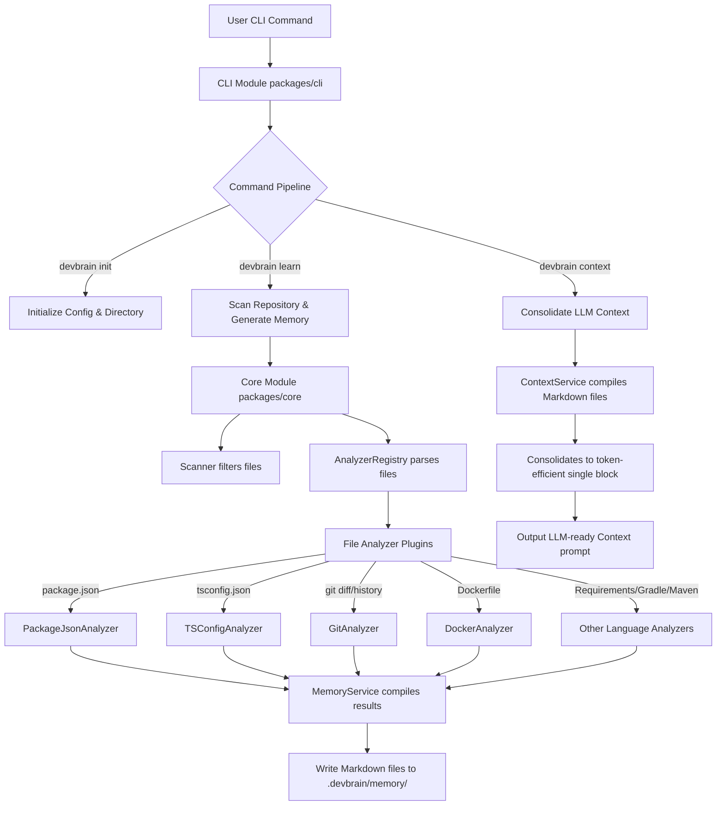

# DevBrain

[](LICENSE)
[](package.json)
[](#)
[](package.json)

**DevBrain** is an offline-first, production-quality command-line interface (CLI) tool designed to generate and maintain persistent, deterministic project memory for AI assistants. It works locally to scan your repository, analyze your technology stack and file organization, and output a highly optimized, token-efficient single block of context that you can feed directly to any Large Language Model (LLM).

---

## 🏗️ Architecture Overview

DevBrain uses a modular, multi-package architecture configured with native NPM workspaces:



*   **`packages/shared`**: Contains centralized custom error structures, types, configurations, and core constant values.
*   **`packages/core`**: Implements filesystem access, repository scanner (respecting `.gitignore` and default exclusions), pluggable analyzer registry, memory generators, and context consolidation engines.
*   **`packages/cli`**: Coordinates commands using Commander.js, presents user logs via Chalk, and runs progress indicators with Ora spinners.

---

## 📦 Installation

To install DevBrain globally, ensure you have Node.js LTS (>=20) installed:

```bash
npm install -g devbrain
```

Alternatively, you can run it on-demand using `npx`:

```bash
npx devbrain --help
```

---

## 🚀 Quick Start

Initialize, train, and generate LLM-ready context with three simple commands:

```bash
# 1. Initialize the DevBrain memory directory in your project
devbrain init

# 2. Scan the repository and generate memory files
devbrain learn

# 3. Output the LLM-ready consolidated context
devbrain context
```

---

## 🛠️ Command Reference

### `devbrain init [options]`
Initializes the `.devbrain/` folder structure, sets default exclusions, and generates `.devbrain/config.json`.

*   `-f, --force`: Overwrites any existing config files and reinitializes.
*   `-h, --help`: Displays help info for the initialization command.

### `devbrain learn [options]`
Scans the project files, executes registered language/stack analyzers, and generates deterministic markdown documents in `.devbrain/memory/`.

*   `-h, --help`: Displays help info for the learning command.

### `devbrain context [options]`
Consolidates all markdown documents from `.devbrain/memory/` and formats them into a single-block text prompt designed for AI assistant consumption.

*   `-h, --help`: Displays help info for the context consolidation command.

---

## ⚙️ Configuration Customization

Upon running `devbrain init`, a `.devbrain/config.json` is created in your workspace root. You can customize the behavior of the scanner by adding file path patterns to ignore:

```json
{
  "exclude": [
    "**/node_modules/**",
    "**/dist/**",
    "**/build/**",
    "**/.git/**",
    "**/coverage/**"
  ]
}
```

---

## 🔌 Supported Analyzers

DevBrain supports a pluggable analyzer registry. During `devbrain learn`, the registry automatically detects project configuration files and generates structured metadata:

| Analyzer Plugin | Target File(s) | Description / Metadata Extracted |
|---|---|---|
| **PackageJson** | `package.json` | Project name, version, private status, and workspace groupings. |
| **TSConfig** | `tsconfig.json` | Extracted paths, aliases, target version, module options. |
| **Git** | `.git` | Active branch name, commit hash, latest release tag, and dirty file status. |
| **Docker** | `Dockerfile` | Image configuration steps, build instructions. |
| **RequirementsTxt**| `requirements.txt` | Python package names and version ranges. |
| **PomXml** | `pom.xml` | Maven artifact IDs, dependencies, and plugins. |
| **BuildGradle** | `build.gradle` | Gradle tasks, dependency imports, repository sources. |
| **Readme** | `README.md` | Primary features description, user guides, setup instructions. |

---

## 🤝 Contributing

Contributions are welcome! Please see [CONTRIBUTING.md](CONTRIBUTING.md) for local setup, styling requirements, and the release submission process.

## 📄 License

DevBrain is open-source software licensed under the [MIT License](LICENSE).
